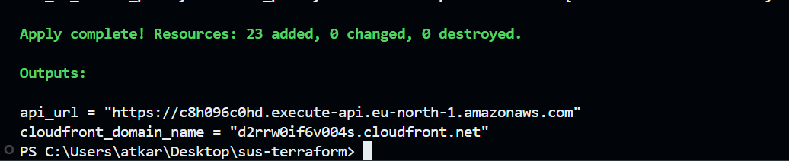
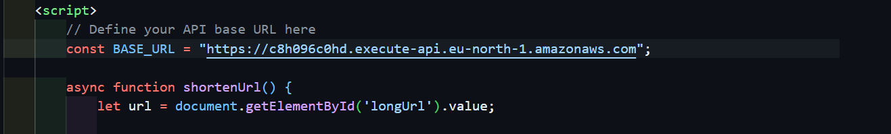
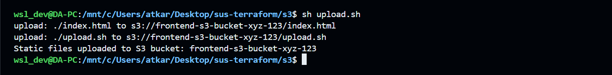
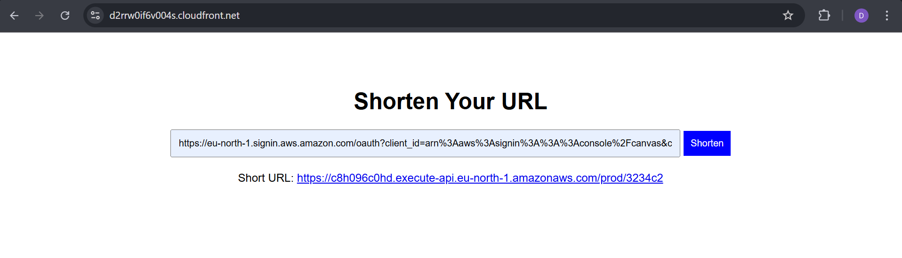

#  AWS Serverless URL Shortener – Terraform Deployment

This guide outlines how to deploy the **fully serverless URL shortener** using **Terraform** on AWS. The architecture includes:

### ✅ Services Used:
- **Amazon API Gateway** – Handles API requests
- **AWS Lambda** – Backend logic for URL creation and redirection
- **Amazon DynamoDB** – Stores short URL mappings
- **Amazon S3** – Hosts the frontend (private bucket)
- **Amazon CloudFront** – Delivers the frontend via secure global CDN
- **Amazon CloudWatch** – Logs Lambda and API activity
- **IAM Roles & Policies** – Manages service permissions
- **S3 Origin Access Control (OAC)** – Secures CloudFront-to-S3 access


## 🛠 Terraform Setup

### 1️⃣ Initialize Terraform
```bash
terraform init
```

### 2️⃣ Validate & Plan the Deployment
```bash
terraform validate
terraform plan
```

### 3️⃣ Deploy the Infrastructure
```bash
terraform apply
```



---

## ✅ Post Deployment Steps

### 🔁 1. Update `api_url` in Frontend

After deployment, copy the **API Gateway URL** from Terraform output and replace the value of `api_url` in your `index.html`.



---

### ☁️ 2. Upload Frontend to S3

Upload the updated frontend file to the S3 bucket:
```bash
cd s3
sh upload.sh
```

> Example:


---

### 🌐 3. Access the Web App

Grab the **CloudFront CDN domain** from the Terraform output and open it in your browser.

> Example:


---

## 🔥 Clean Up Resources

When you're done and want to remove all resources:
```bash
terraform destroy --auto-approve
```

---
