# Static Website Hosting on AWS S3 & CloudFront

## Project Overview
This project demonstrates how to host a static website on AWS using **S3** and **CloudFront**. Instead of making the S3 bucket public, we will keep it **private** and use CloudFront as the primary hosting mechanism for our website. This approach enhances security by restricting direct access to the S3 bucket and ensuring that only CloudFront can retrieve and serve content. Additionally, AWS Web Application Firewall (WAF) can be used for added protection against malicious traffic.

## Project Architecture
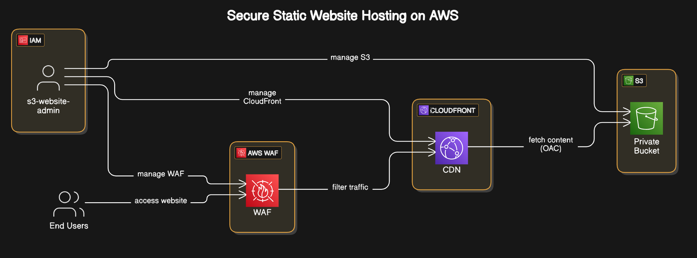

## Tech Stack
- **AWS S3** – Stores the website files securely.
- **AWS CloudFront** – Speeds up content delivery with a CDN and serves files from a private S3 bucket.
- **AWS IAM** – Manages access and permissions.
- **AWS WAF** – Provides an additional layer of security by filtering web traffic.

## Implementation Steps
### Step 1: Create IAM User & Role
1. Sign in to the **AWS Management Console**.
2. Navigate to **IAM (Identity and Access Management)**.
3. Click **Users** → **Add User**.
4. Set the user name (e.g., `s3-website-admin`).
5. Choose **Programmatic Access**.
   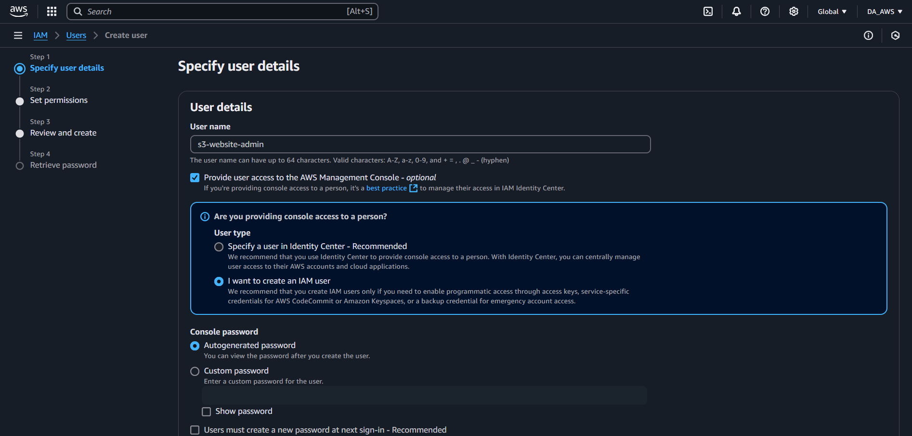
6. Attach the following policies:
   - `AmazonS3FullAccess`
   - `CloudFrontFullAccess`
   - `AWSWAFFullAccess`
   
   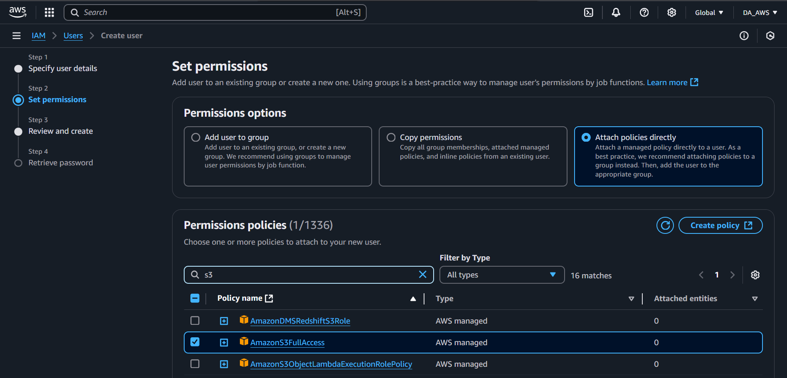
   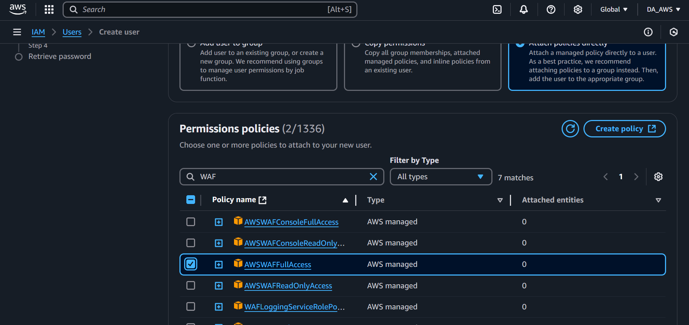
   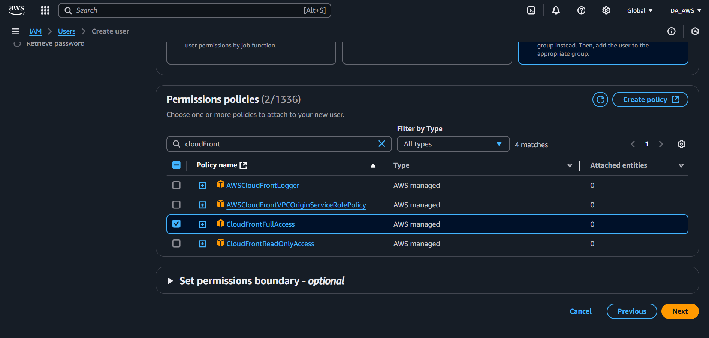
7. Click **Create User** and note down the Access Key ID and Secret Access Key.
   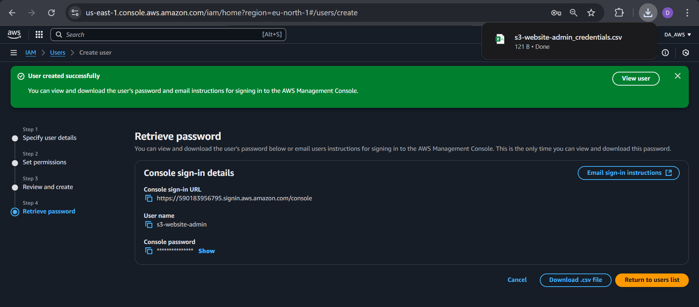
8. **Log in with this IAM user** to continue the setup.
   

### Step 2: Create an S3 Bucket & Upload Website Files
1. Go to the **S3 Console**.
2. Click **Create Bucket**.
3. Enter a unique **bucket name** (e.g., `my-static-website-project-1-0001`).
4. **Keep Block Public Access enabled** to ensure the bucket remains private.
5. Click **Create Bucket**.
   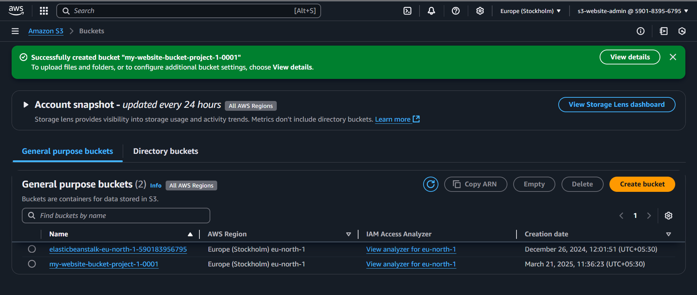
6. Upload the website files (HTML, CSS, JS) to the bucket.
   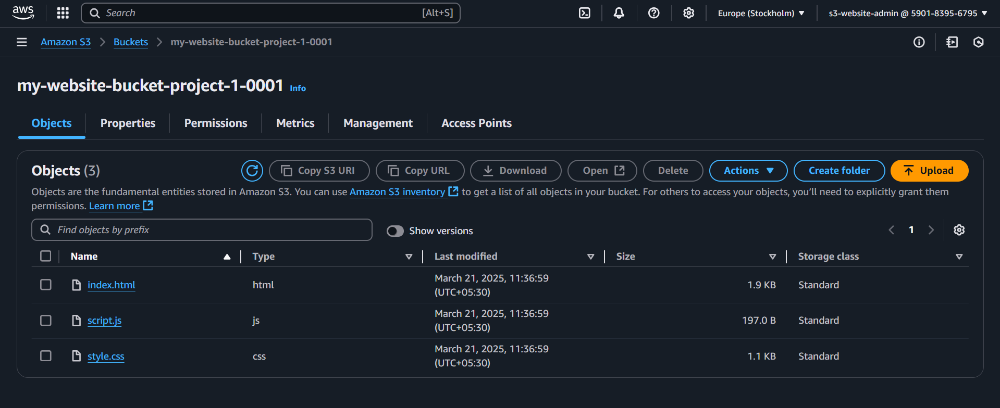

### Step 3: Set Up a CloudFront Distribution
1. Navigate to **CloudFront Console**.
2. Click **Create Distribution**.
3. Under **Origin**, select the **S3 bucket** (not the static website endpoint).
   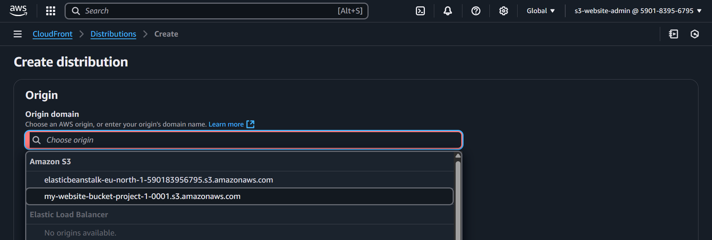
4. Under **Origin access**, select **Origin access control settings (recommended)**.
   - Click **Create Control Setting**, name it **S3-OAC**, and save.

   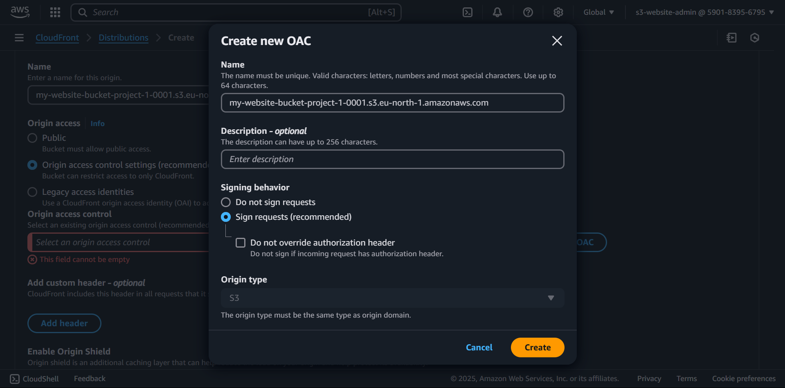
   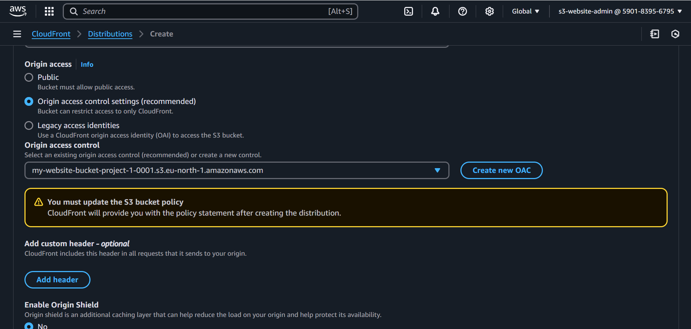
   - **Note:** S3-OAC (Origin Access Control) ensures that only CloudFront can access the S3 bucket, keeping it private and secure. This eliminates the need to make S3 objects publicly accessible while still allowing seamless content delivery.
5. Scroll down to **Settings** and select **Firewall Protection**.
6. Click **Create Distribution** and wait for it to deploy.
   

### Step 4: Allow CloudFront to Access S3
1. Copy the **S3 Buck Policy**
2. And just paste it:  
   Example:
   ```json
   {
      "Version": "2008-10-17",
      "Id": "PolicyForCloudFrontPrivateContent",
      "Statement": [
         {
            "Sid": "AllowCloudFrontServicePrincipal",
            "Effect": "Allow",
            "Principal": {
            "Service": "cloudfront.amazonaws.com"
            },
            "Action": "s3:GetObject",
            "Resource": "arn:aws:s3:::my-website-bucket-project-1-0001/*",
            "Condition": {
            "StringEquals": {
               "AWS:SourceArn": "arn:aws:cloudfront::AWS_ACCOUNT_ID:distribution/CLOUDFRONT_DISTRIBUTION_ID"
               }
            }
         }
      ]
   }
   ```
   
3. Click **Save Changes**.
   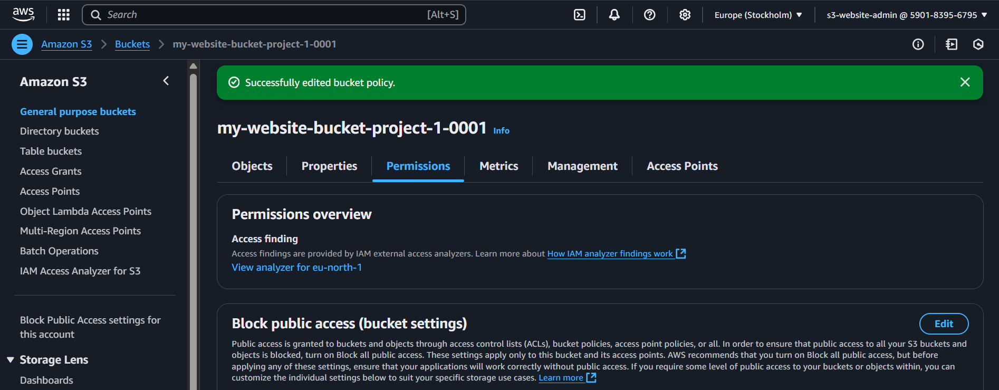

### Step 5: Configure CloudFront to Serve index.html
1. In the **CloudFront Console**, go to the **Distributions** list.
2. Click on your **Distribution ID**.
3. Navigate to the **General** tab.
4. Scroll to **Settings** -> Click **Edit**.
5. In the **Default Root Object** field, enter `index.html`.
   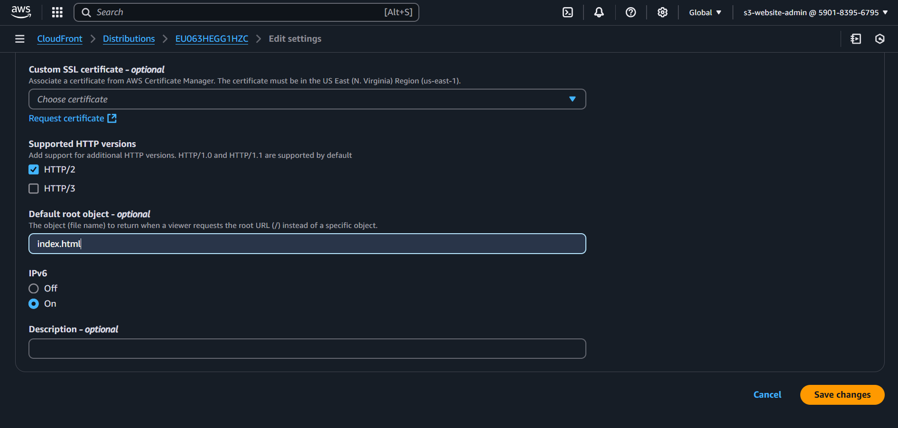
6. Click **Save Changes**.
   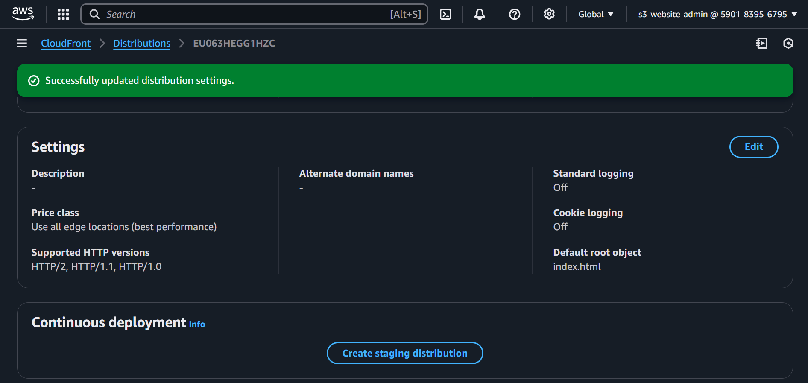

### Step 6: Test the Website
- Open the **CloudFront Distribution Domain Name** in a browser to verify the website loads correctly.
   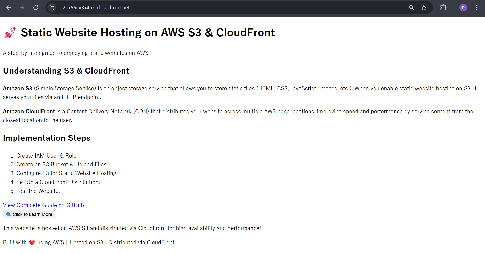

## Cleanup: Delete All Resources to Avoid Charges
1. **Delete CloudFront Distribution**: 
   - Disable the distribution.
   - Wait for status to change to **Disabled**, then delete it.
2. **Delete S3 Bucket**:
   - Empty the bucket.
   - Delete the bucket.
3. **Remove IAM User**:
   - Go to IAM and delete the user.

By following these steps, you can securely host a static website on AWS using CloudFront while keeping the S3 bucket private. 🚀

