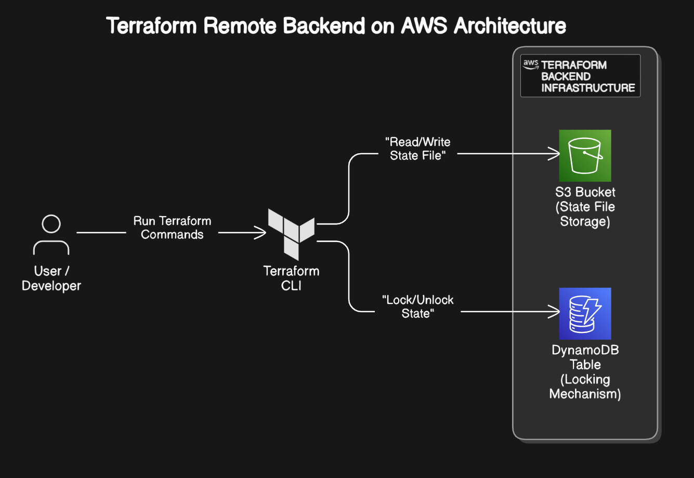

# Terraform Remote Backend with AWS S3 & DynamoDB

This project demonstrates how to set up a **remote backend** for Terraform using **Amazon S3** and **DynamoDB**. It separates the infrastructure for state storage from your main IaC projects, allowing safe, scalable, and collaborative Terraform usage.


## 🚀 What This Project Does

🔹 **S3 Bucket** – Stores Terraform state files securely and versioned  
🔹 **DynamoDB Table** – Handles locking and prevents concurrent state modifications  
🔹 **Backend Config** – Connects your Terraform projects to the remote backend

## Architecture


## 💡 Why Use a Remote Backend?

Terraform stores information about your deployed infrastructure in a state file. Using a remote backend:
- Keeps the state safe and versioned
- Enables collaboration (CI/CD or team)
- Locks the state to prevent corruption during simultaneous runs
- Allows easier rollback and audit


## ⚙️ How to Set It Up

### Step 1: Provision the Backend Infrastructure

1. Navigate to the infra folder:
   ```bash
   cd backend-infra
   ```

2. Initialize and plan:
   ```bash
   terraform init
   terraform plan
   ```

3. Apply the configuration:
   ```bash
   terraform apply -auto-approve
   ```

This will create:
- An S3 bucket (with versioning & encryption)
- A DynamoDB table (with hash key `LockID`)

---

### Step 2: Use the Remote Backend in Your Terraform Projects

1. Copy `backend.tf` into your actual Terraform project directory (root level).

2. Update the `bucket`, `region`, and `dynamodb_table` fields in `backend.tf` if needed:
   ```hcl
   terraform {
     backend "s3" {
       bucket         = "your-bucket-name"
       key            = "your-project/terraform.tfstate"
       region         = "your-region"
       dynamodb_table = "your-lock-table"
       encrypt        = true
     }
   }
   ```

3. Re-initialize Terraform in your project:
   ```bash
   terraform init
   ```
   

   > ⚠️ This will prompt to migrate local state (if any) to remote.

4. Continue working as usual:
   ```bash
   terraform plan
   terraform apply
   ```

## ✅ Verify
Go to your S3 bucket and confirm that the terraform.tfstate file is uploaded:
   

## ✅ Best Practices

- Enable **MFA** and **least-privilege** IAM roles for access to the backend resources.
- Keep the backend infra (`backend-infra/`) in a **separate repository** for security/isolation.
- Tag your S3 bucket and DynamoDB resources for clarity.
- Enable access logging for your S3 bucket.

---